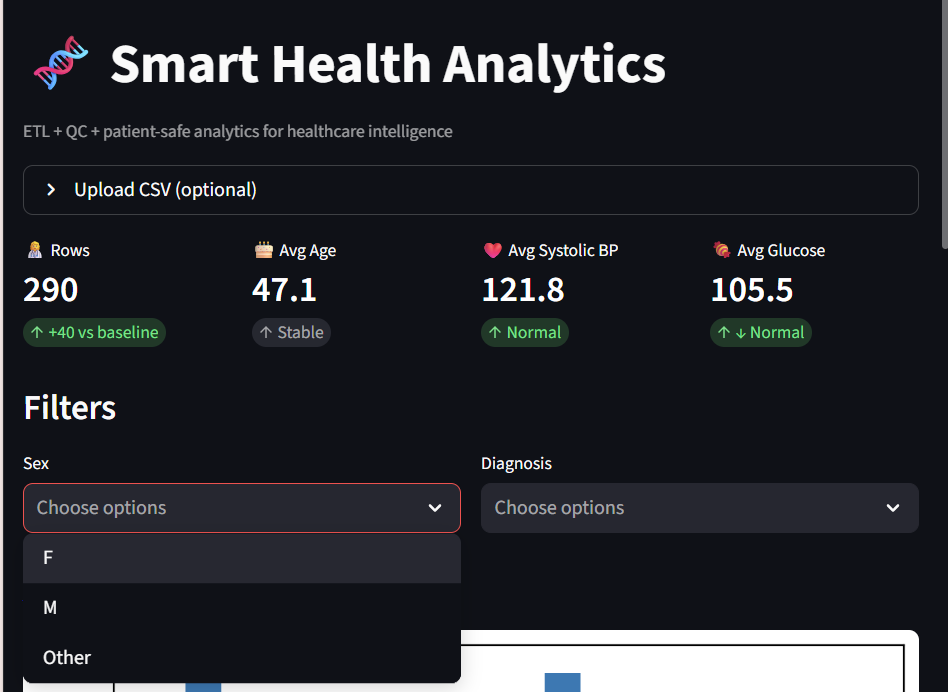
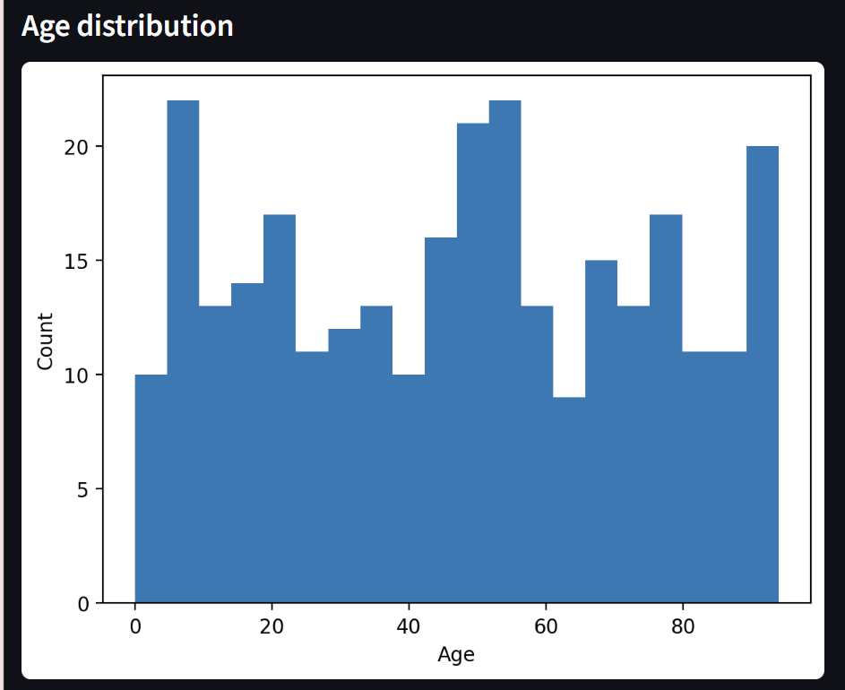
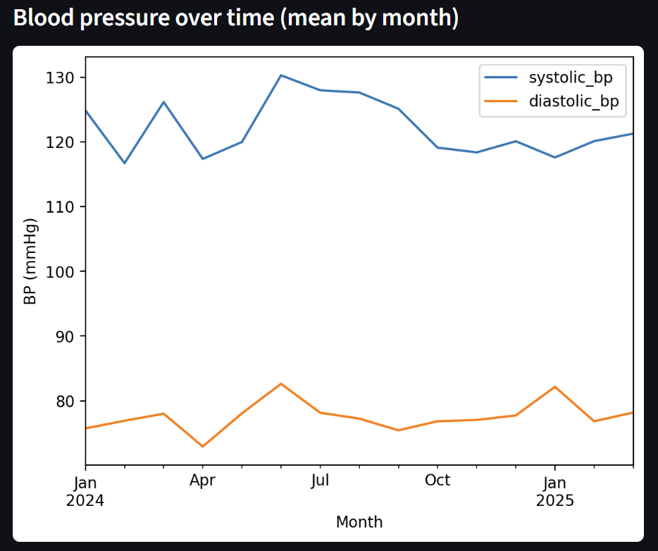
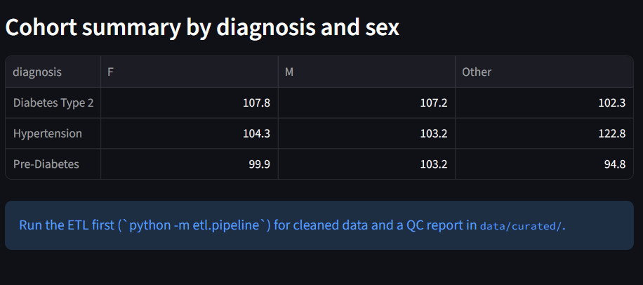

# 🧬 Smart Health Analytics

**ETL + QC + patient-safe analytics for healthcare intelligence**

A lightweight healthcare analytics pipeline built with **Python, Pandas, SQL, and Streamlit** — designed for clean, safe, and actionable patient insights.


## 🚀 Features

- **ETL Pipeline:** Ingests CSV data, validates schema, removes bad values, and de-identifies sensitive info.  
- **QC Framework:** Range checks, null checks, z-score outlier detection, and a visual HTML report.  
- **Streamlit Dashboard:** Interactive KPIs, filters, and cohort analytics.  
- **Azure DevOps Ready:** Includes CI pipeline for automated testing.  
- **100% Synthetic & Patient-Safe Data**


## 🧠 Tech Stack
`Python` · `Pandas` · `SQL` · `Azure DevOps` · `Streamlit`


## 📸 Preview

| KPI Summary | Data Distribution | Trend Analysis |
|--------------|-------------------|----------------|
|  |  |  |

<p align="center">
  
</p>


## ⚙️ Setup

```bash
git clone https://github.com/samruddhi2204/smart-health-analytics.git
cd smart-health-analytics
pip install -r requirements.txt
python -m etl.pipeline
streamlit run app.py
